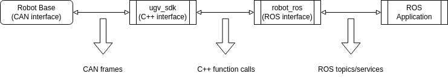

# UGV SDK


## Introduction

This software package provides a C++ interface to communicate with the mobile platforms, for sending commands to the
robot and receiving the latest robot state. The repository is a joint effort by the development teams at Weston Robot (Singapore) and AgileX Robotics (China).

- Copyright (c) 2020-2023 [Weston Robot](https://www.westonrobot.com/)
- Copyright (c) 2020-2023 [AgileX Robotics](http://www.agilex.ai/?lang=zh-cn)

Please create an issue on Github at https://github.com/westonrobot/ugv_sdk/issues if you encounter any problems when
using the packages.

## Supported Platforms
### Software environments

* Architecture: x86_64/arm64
* OS: Ubuntu 18.04/20.04/22.04
* ROS: Melodic/Noetic/Foxy/Humble

It should also work in other similar Linux environments but only the above listed environments are regularly tested.

### Robots and communication protocols

|        Robot        | Protocol V1 | Protocol V2 | UART  |  CAN  | Support Status |
| :-----------------: | :---------: | :---------: | :---: | :---: | :------------: |
|    ~~Scout 1.0~~    |      Y      |      -      |   N   |   Y   |  Discontinued  |
|      Scout 2.0      |      Y      |      Y      |   N   |   Y   |     Active     |
|  Scout Mini (Skid)  |      Y      |      Y      |   -   |   Y   |     Active     |
|  Scout Mini (Omni)  |      Y      |      Y      |   -   |   Y   |     Active     |
|     Hunter 1.0      |      Y      |      Y      |   -   |   Y   |     Active     |
|     Hunter 2.0      |      -      |      Y      |   -   |   Y   |     Active     |
|       Bunker        |      Y      |      Y      |   -   |   Y   |     Active     |
|       Tracer        |      -      |      Y      |   N   |   Y   |     Active     |
| ~~Ranger Mini 1.0~~ |      -      |     Y*      |   -   |   Y   |  Discontinued  |
|   Ranger Mini 2.0   |      -      |      Y      |   -   |   Y   |     Active     |
|       Ranger        |      -      |      Y      |   -   |   Y   |     Active     |

**Important note:** 

* The main branch of this repository supports all robot models and both V1 and V2 protocol. Earlier versions of the SDK can be found in v1.x and v2.x branch for V1 and V2 protocol support respectively. These two branches are not actively maintained any longer and are only kept for reference.
* \* Ranger Mini 1.0 uses a modified version of Protocol V2. A few CAN messages and the reference frame definitions are inconsistent with other robot bases. Since this model has been discontinued by AgileX (as in May 2023), no new firmware will be released to fix this issue on Ranger Mini 1.0. Thus, a fix is provided for Ranger Mini 1.0 at the SDK level. You should use "class RangerMiniV1Robot" for Ranger Mini 1.0 to get consistent behaviors, as compared to Ranger and Ranger Mini 2.0.

## Build SDK

### Install dependencies

```
$ sudo apt-get update
$ sudo apt-get install build-essential git cmake libasio-dev
```

### Build the package in a catkin workspace

```
$ cd <your-catkin-ws>/src
$ git clone https://github.com/westonrobot/ugv_sdk.git
$ cd ..
$ catkin_make
```

## Setup CAN-To-USB Adapter

1. Enable gs_usb kernel module
    ```
    $ sudo modprobe gs_usb
    ```
2. Bringup can device
   ```
   $ sudo ip link set can0 up type can bitrate 500000
   ```
3. If no error occured during the previous steps, you should be able to see the can device now by using command
   ```
   $ ifconfig -a
   ```
4. Install and use can-utils to test the hardware
    ```
    $ sudo apt install can-utils
    ```
5. Testing command
    ```
    # receiving data from can0
    $ candump can0
    # send data to can0
    $ cansend can0 001#1122334455667788
    ```

Two scripts inside the "./scripts" folder are provided for easy setup. You can run "./setup_can2usb.bash" for the
first-time setup and run "./bringup_can2usb.bash" to bring up the device each time you unplug and re-plug the adapter.

## Log CAN Data

In the case that you get an issue with the robot base, you can log the CAN data to a file for further analysis. To do
so, run

```bash
$ candump -l can0
```

If you're using a different CAN interface, replace "can0" with the name of your interface.

The log file can be replayed using the following command

```bash
$ canplayer -I <candump-log-file-name>.log
```

## Sample Code

You can find sample code for each robot in "sample" folder. For example, you can run the demo for Scout robot

```
$ ./bin/demo_scout_robot can0
```

**Important note:**

* **The demo program may command the robot to move!** Please make sure you have the remote controller with you and the
  robot is in a safe place to move around. You can also modify the demo code to disable the motion commands.
* If the robot is not moving as expected, please first check if the remote controller is in manual mode and if the
  E-Stop buttons are released.

## Develop Applications with the SDK

There are certain cases where you may want to use the C++ interface from the SDK directly, instead of using a ROS wrapper (such as [scout_ros](https://github.com/westonrobot/scout_ros)). This section provides a brief description of the SDK design to help you get started more easily.

#### The communication pipeline

The complete pipeline from the robot base to a ROS application is illustrated in the following diagram. A main function of the SDK is to translate between raw CAN frames and C++ data structures so that you can programmatically interact with the robot.



With this structure in mind, whenever you are facing issues communicating with the robot, you can follow the pipeline to locate the cause of the problem: 

* First try to use "candump" to check if the CAN communication is working properly. If no CAN message is received from the CAN bus, it means that either the robot controller or the CAN adapter or the CAN wiring has issues. 
* If there is no issue found on the CAN bus, you can try to use the SDK to query robot state and control the robot to move. Since the SDK is mainly acting as a CAN message translator, if the CAN bus is normal, then most likely you can successfully talk with the robot using the SDK. Otherwise, you can report an issue with the SDK.
* If there is no issue found in the SDK, then you may need to check if your ROS environment is set up properly (e.g. the ROS network setup).

#### The abstraction layers

Besides translating between CAN messages and C++ data structures, another important function of the SDK is to provide a set of interfaces to all the different robot models. In order to minimize duplicated code for different robot models, we structured the SDK into 3 abstraction layers:

* **interface** (include/ugv_sdk/details/interface): this layer defines the C++ APIs for all the robots, e.g., the functions that you can call to get the state of the robot. A complete list of interfaces for a specific robot consists of two parts: the robot common interface (RobotCommonInterface) and the robot-specific interface (e.g., ScoutInterface).
* **robot_base** (include/ugv_sdk/details/robot_base): this layer implements the C++ APIs for each family of robot (e.g., Scout/ScoutMiniOmni/ScoutMiniSkid) and handles the different versions of CAN communication protocols (most functionalities are implemented in this layer). With this layer, you can already communicate with a specific robot (e.g., Scout V2.0 with Protocol V2).
* **mobile_robot** (include/ugv_sdk/mobile_robot): the main purpose of this layer is to provide an unified interface class to instantiate different robot models from the same family according to given parameters during runtime (handling polymorphism internally).

"mobile_robot" layer should be the layer you check first for your application. You only need to refer to the other two layers if more details are required.

## Reference

* [CAN command reference in Linux](https://notes.rdu.im/system/linux/canbus/)
